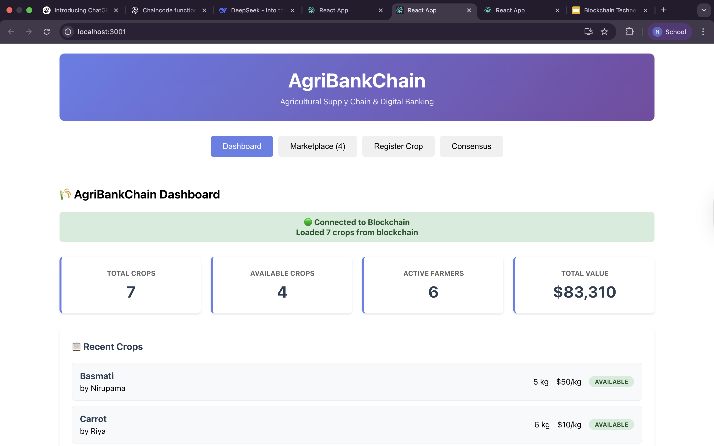
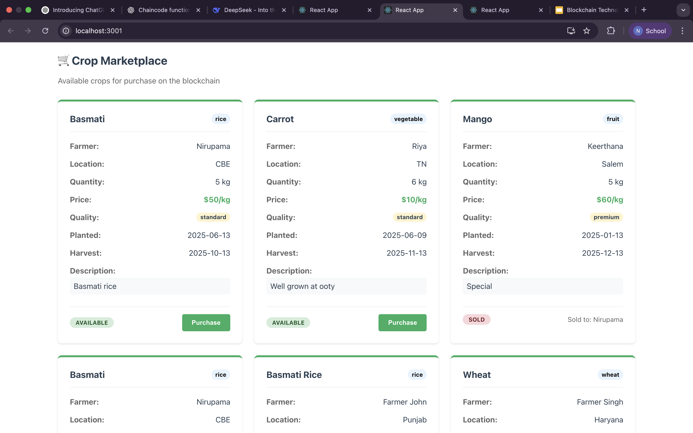
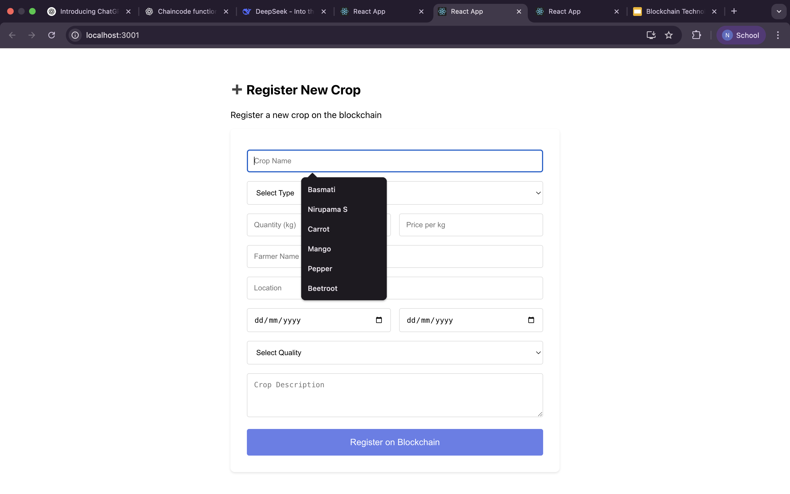
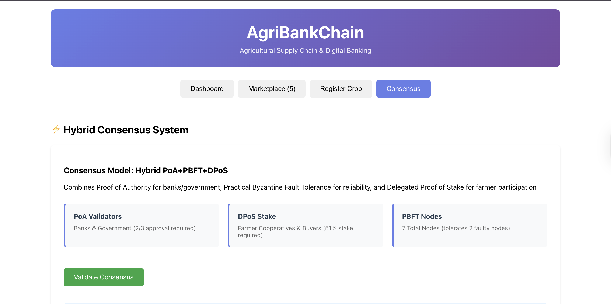
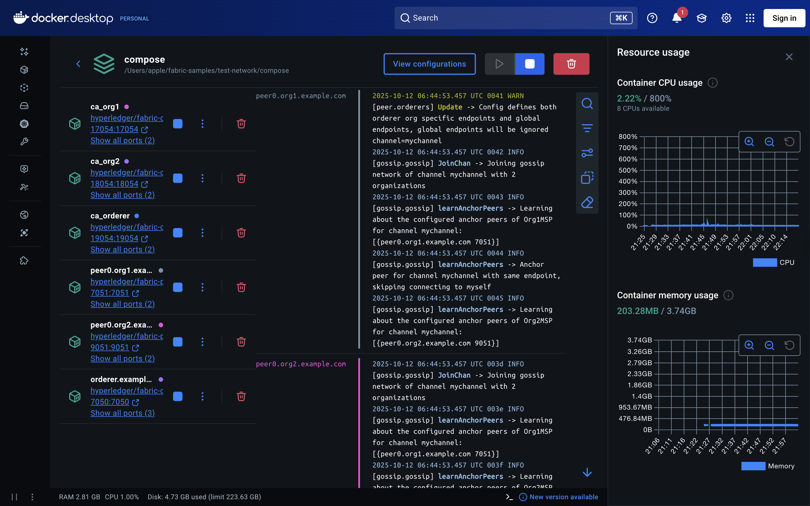

# AgriBankChain - Agricultural Supply Chain on Blockchain

AgriBankChain is a blockchain-based agricultural marketplace built using Hyperledger Fabric.  
It enables secure interaction between farmers, buyers, and financial institutions with full transparency and traceability of transactions.

---

## Overview

This system is designed to improve trust and efficiency in the agricultural supply chain.

It allows:

- Farmers to register crops and manage listings  
- Buyers to purchase agricultural produce securely  
- Banks to provide crop-backed loans based on verified data  

All actions are recorded on a blockchain ledger to ensure data integrity and prevent tampering.

---

## Features

- Hybrid consensus mechanism (PoA + DPoS + PBFT)  
- Crop registration and management system  
- Secure crop purchase workflow  
- Loan application and processing  
- Real-time blockchain updates  
- High-value transaction validation (> $5000)

---

## Architecture

Frontend (React)  
→ Backend API Server (Node.js + Express)  
→ Hyperledger Fabric Network  
→ Smart Contracts (Go Chaincode)

---

## Consensus Model

PoA → Banks + Government approval (2/3 rule)  
DPoS → Stakeholder voting system  
PBFT → Fault tolerance across network nodes  

Used for high-value transactions above $5000.

---

## Tech Stack

- Frontend: React, CSS  
- Backend: Node.js, Express  
- Blockchain: Hyperledger Fabric 2.5  
- Smart Contracts: Go  
- Infrastructure: Docker, Docker Compose  

---

## Requirements

- Node.js (v16+)  
- npm  
- Docker Desktop  
- Go (1.19+)  
- Hyperledger Fabric binaries  

---

## Setup Instructions

### 1. Clone Repository
```bash
git clone https://github.com/Nirupama-Shankar/agrichain-blockchain.git
cd agrichain-blockchain
```
### 2. Start Blockchain Network
```bash
cd network
./network.sh up createChannel -c mychannel -ca
./network.sh deployCC -ccn agrichain -ccp ../chaincode -ccl go
```
### 3. Set Environment Variables
```bash
export PATH=${PWD}/../bin:$PATH
export FABRIC_CFG_PATH=${PWD}/../config/
export CORE_PEER_TLS_ENABLED=true
export CORE_PEER_LOCALMSPID="Org1MSP"
export CORE_PEER_TLS_ROOTCERT_FILE=${PWD}/organizations/peerOrganizations/org1.example.com/peers/peer0.org1.example.com/tls/ca.crt
export CORE_PEER_MSPCONFIGPATH=${PWD}/organizations/peerOrganizations/org1.example.com/users/Admin@org1.example.com/msp
export CORE_PEER_ADDRESS=localhost:7051
```
### 4. Start Backend Server
```bash
cd ../fullstack-app
node server.js
```
### 5. Start Frontend
```bash
cd ../frontend
npm install
npm start
```
---

## API Endpoints

- GET /health
- POST /channels/mychannel/chaincodes/agrichain
---

## Smart Contract Functions

- GetAllCrops
- CreateCrop
- PurchaseCrop
- PurchaseCropWithConsensus
- ApplyForLoan
- GetLoansByFarmer
---

## Project Structure

```text
Agri-Bank-Chain/
├── frontend/              # React frontend application
├── fullstack-app/        # Node.js + Express backend API
├── network/              # Hyperledger Fabric network setup
├── chaincode/           # Smart contracts (Go chaincode)
├── screenshots/         # Project UI screenshots
├── demo-video.mp4       # Project demo video
└── start-rest-server.sh # Script to start backend server
```
---
## Screenshots

### Home Page


### Market Place


### Crop Registration


### Hybrid Consensus


### Docker

---

## Troubleshooting
- Port already in use → kill process using that port
- Backend not responding → check /health endpoint
- Chaincode error → restart network
- UI not updating → refresh browser
---

## Contributing
- Fork repository
- Create branch
- Commit changes
- Push branch
- Open Pull Request
---

## Author

Shobika S

Full Stack Blockchain Developer

---

## License

This project is licensed under the MIT License.

You are free to use, modify, and distribute this project for personal or commercial use with proper attribution.

See the LICENSE file for more details.


